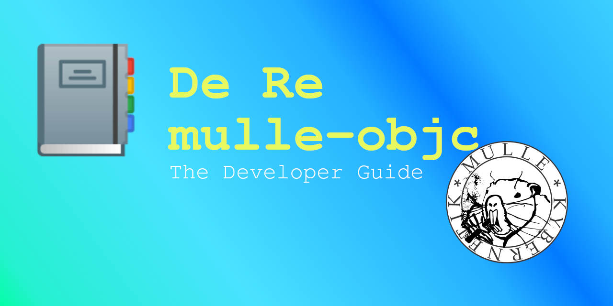



Welcome to the developer guide for [mulle-objc](//mulle-objc.github.io). This
guide will enable you to get up and running quickly with Objective-C on the
platform of your choice.


## Why Objective-C ?

If you are comfortable writing in C, you will notice that C is fine until you
reach a certain level of complexity. If you don't want to spend your lifetime
in C++ bureaucracy, Objective-C is the answer:

* Easy to learn
* Fun
* No magic
* A dynamic messenger
* A powerful class-system
* Cross-platform


## Install mulle-objc

This guide doesn't have detailed installation instructions for **mulle-objc**.
Read the instructions on
[foundation-developer](https://github.com/MulleFoundation/foundation-developer)
and follow them.

Afterwards you should have **mulle-clang** and **mulle-sde** in your PATH.

``` console
mulle-clang --version
mulle-sde --version
```

## Development

Objective-C is an [Object Oriented Programming Language](https://en.wikipedia.org/wiki/Object-oriented_programming).
With that comes the expectation of a [plug-n-play](https://dl.acm.org/doi/10.1145/2601328.2601334) programming environment.
It should be possible to add and remove functionality, without
breaking the application. This expectation has been historically never
fulfilled, due to deficiencies with the compilation tools, the Objective-C
runtime and the way headers are handled.


### Modern Workflow

The modern workflow provides such a plug-n-play environment.

If you are a complete newbie [learn Objective-C](mydoc_links.html) with
the [modern workflow](mydoc_modern.html).

If you want to experience the full power MulleObjC has to offer, then use the
[modern workflow](mydoc_modern.html).


### Legacy Workflow

If you are a seasoned Objective-C programmer, who would like to try porting
some of his existing code to mulle-objc, then start with the [legacy workflow](mydoc_legacy.html).


## Applicable Domain

mulle-objc is not light-weight and it's not heavy-weight either. When you
build the Foundation library as a shared library you end up with 2.5MB.
That means any system with less than than 4MB RAM of address
space, will likely not cut it. The CPU needs to be 32 bit wide at least.

mulle-objc compiles directly to machine code and runs on the CPU and not in
a java/.NET virtual machine. So cloud computing in AWS lambdas is also not
possible, though WebAssembly is probably in the cards. For everything else
inbetween mulle-objc is the way to go.

mulle-objc is permissively licensed and free of cost, meaning you can use it
anywhere.


## Next

The next step is to [Learn Objective-C](mydoc_links.html). Or if you
already know the language, skip to [Basics](mydoc_basics.html)


